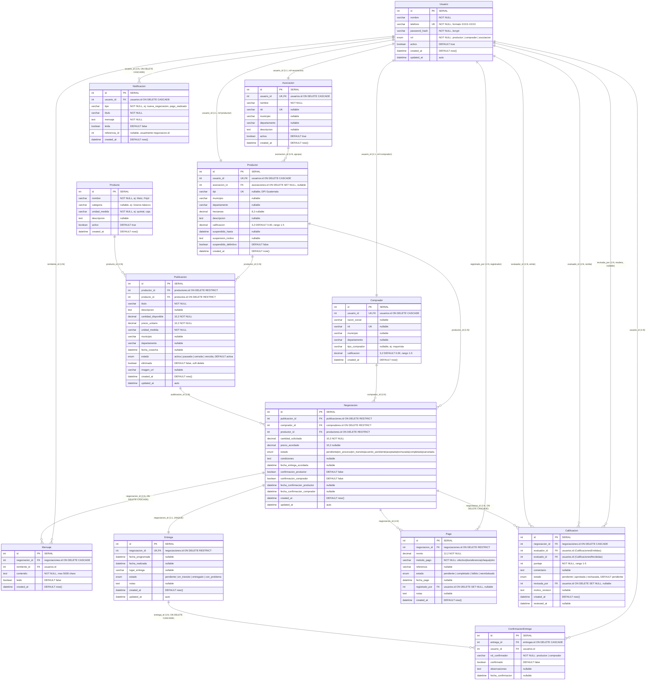

# Documentación del Diagrama Entidad-Relación (ER)

## Sistema La Esperanza — Plataforma de Gestión Agrícola

> **Tecnologías:** Node.js + Express + Prisma ORM + PostgreSQL 16 + React + Docker  
> **Propósito:** Digitalizar la comercialización agrícola directa entre productores y compradores, con asociaciones como entes organizadores.

---

## 1. Resumen de Entidades (13 tablas)

| # | Entidad | Tabla | Descripción |
|---|---------|-------|-------------|
| 1 | **Usuario** | `usuarios` | Actor base del sistema. Contiene auth (teléfono + password) y un rol. |
| 2 | **Productor** | `productores` | Perfil del agricultor. Extiende Usuario (rol=productor). |
| 3 | **Comprador** | `compradores` | Perfil del comprador. Extiende Usuario (rol=comprador). |
| 4 | **Asociacion** | `asociaciones` | Perfil de asociación agrícola. Extiende Usuario (rol=asociacion). Agrupa productores. |
| 5 | **Producto** | `productos` | Catálogo de productos agrícolas (maíz, frijol, etc.). Tabla lookup. |
| 6 | **Publicacion** | `publicaciones` | Oferta de venta creada por un productor. |
| 7 | **Negociacion** | `negociaciones` | Transacción central entre productor y comprador. Máquina de estados. |
| 8 | **Mensaje** | `mensajes` | Chat dentro de una negociación. |
| 9 | **Entrega** | `entregas` | Seguimiento de entrega del producto (1 por negociación). |
| 10 | **ConfirmacionEntrega** | `confirmaciones_entrega` | Doble confirmación de entrega (productor envía, comprador recibe). |
| 11 | **Pago** | `pagos` | Registro de pagos asociados a una negociación. |
| 12 | **Notificacion** | `notificaciones` | Notificaciones del sistema por usuario. |
| 13 | **Calificacion** | `calificaciones` | Valoración entre usuarios (1-5 estrellas), moderada por asociaciones. |

---

## 2. Diagrama ER (Mermaid)



---

## 3. Enums del Sistema (6)

| Enum | Valores | Usado en |
|------|---------|----------|
| **Rol** | `productor`, `comprador`, `asociacion` | `Usuario.rol` |
| **EstadoPublicacion** | `activa`, `pausada`, `cerrada`, `vencida` | `Publicacion.estado` |
| **EstadoNegociacion** | `pendiente`, `en_proceso`, `en_transito`, `acuerdo_pendiente`, `aceptada`, `rechazada`, `completada`, `cancelada` | `Negociacion.estado` |
| **EstadoEntrega** | `pendiente`, `en_transito`, `entregado`, `con_problema` | `Entrega.estado` |
| **EstadoPago** | `pendiente`, `completado`, `fallido`, `reembolsado` | `Pago.estado` |
| **EstadoCalificacion** | `pendiente`, `aprobada`, `rechazada` | `Calificacion.estado` |

---

## 4. Máquina de Estados — Negociación

```
pendiente         ──> en_proceso, en_transito, rechazada, cancelada
en_proceso        ──> en_transito, rechazada, cancelada
en_transito       ──> cancelada
acuerdo_pendiente ──> en_transito, rechazada, cancelada
aceptada          ──> en_transito, completada, cancelada
rechazada         ──> [terminal]
completada        ──> [terminal]
cancelada         ──> [terminal]
```

**Reglas de negocio clave:**
- Cuando `confirmacion_productor = true` Y `confirmacion_comprador = true`, el estado pasa automáticamente a `en_transito`.
- `completada` nunca se asigna directamente — se deriva automáticamente cuando:
  - `entrega.estado = 'entregado'` Y
  - suma de `pagos` con estado `completado` >= `precio_acordado * cantidad_solicitada`.

---

## 5. Cardinalidad de Relaciones

```
Usuario        1 ──── 1    Productor           (extensión por rol)
Usuario        1 ──── 1    Comprador           (extensión por rol)
Usuario        1 ──── 1    Asociacion          (extensión por rol)

Asociacion     1 ──── N    Productor           (asociacion_id)
Producto       1 ──── N    Publicacion         (producto_id)
Productor      1 ──── N    Publicacion         (productor_id)

Publicacion    1 ──── N    Negociacion         (publicacion_id)
Comprador      1 ──── N    Negociacion         (comprador_id)
Productor      1 ──── N    Negociacion         (productor_id)

Negociacion    1 ──── N    Mensaje             (negociacion_id, CASCADE)
Usuario        1 ──── N    Mensaje             (remitente_id)

Negociacion    1 ──── 1    Entrega             (negociacion_id, UNIQUE)
Entrega        1 ──── N    ConfirmacionEntrega (entrega_id, CASCADE)
Usuario        1 ──── N    ConfirmacionEntrega (usuario_id)

Negociacion    1 ──── N    Pago                (negociacion_id)
Usuario        1 ──── N    Pago                (registrado_por)

Usuario        1 ──── N    Notificacion        (usuario_id, CASCADE)

Negociacion    1 ──── N    Calificacion        (negociacion_id, CASCADE)
Usuario        1 ──── N    Calificacion        (evaluador_id)
Usuario        1 ──── N    Calificacion        (evaluado_id)
Usuario        1 ──── N    Calificacion        (revisada_por, nullable)
```

---

## 6. Restricciones Únicas y Especiales

| Tabla | Restricción |
|-------|-------------|
| `usuarios` | `telefono` UNIQUE |
| `productores` | `usuario_id` UNIQUE, `dpi` UNIQUE |
| `compradores` | `usuario_id` UNIQUE, `nit` UNIQUE |
| `asociaciones` | `usuario_id` UNIQUE, `nit` UNIQUE |
| `entregas` | `negociacion_id` UNIQUE (1 entrega por negociación) |
| `confirmaciones_entrega` | `(entrega_id, usuario_id)` UNIQUE (1 confirmación por usuario por entrega) |
| `calificaciones` | `(negociacion_id, evaluador_id, evaluado_id)` UNIQUE (1 evaluación por par por negociación) |

---

## 7. Esquema Prisma (fuente canónica)

Archivo: `backend/prisma/schema.prisma`

```prisma
generator client {
  provider = "prisma-client-js"
}

datasource db {
  provider = "postgresql"
  url      = env("DATABASE_URL")
}

enum Rol {
  productor
  comprador
  asociacion
}

enum EstadoPublicacion {
  activa
  pausada
  cerrada
  vencida
}

enum EstadoNegociacion {
  pendiente
  en_proceso
  en_transito
  acuerdo_pendiente
  aceptada
  rechazada
  completada
  cancelada
}

enum EstadoEntrega {
  pendiente
  en_transito
  entregado
  con_problema
}

enum EstadoPago {
  pendiente
  completado
  fallido
  reembolsado
}

enum EstadoCalificacion {
  pendiente
  aprobada
  rechazada
}

model Usuario {
  id                     Int                   @id @default(autoincrement())
  nombre                 String                @db.VarChar(100)
  telefono               String                @unique @db.VarChar(20)
  password_hash          String                @db.VarChar(255)
  rol                    Rol
  activo                 Boolean               @default(true)
  created_at             DateTime              @default(now())
  updated_at             DateTime              @updatedAt
  productor              Productor?
  comprador              Comprador?
  asociacion             Asociacion?
  mensajes               Mensaje[]
  notificaciones         Notificacion[]
  confirmaciones         ConfirmacionEntrega[]
  pagos_registrados      Pago[]                @relation("PagosRegistrados")
  calificaciones_emitidas  Calificacion[]      @relation("CalificacionesEmitidas")
  calificaciones_recibidas Calificacion[]      @relation("CalificacionesRecibidas")
  calificaciones_revisadas Calificacion[]      @relation("CalificacionesRevisadas")
}

model Productor {
  id                     Int            @id @default(autoincrement())
  usuario_id             Int            @unique
  asociacion_id          Int?
  dpi                    String?        @unique @db.VarChar(20)
  municipio              String?        @db.VarChar(100)
  departamento           String?        @db.VarChar(100)
  hectareas              Decimal?       @db.Decimal(8, 2)
  descripcion            String?        @db.Text
  calificacion           Decimal        @default(0.00) @db.Decimal(3, 2)
  suspendido_hasta       DateTime?
  suspension_motivo      String?        @db.Text
  suspendido_definitivo  Boolean        @default(false)
  created_at             DateTime       @default(now())
  usuario                Usuario        @relation(fields: [usuario_id], references: [id], onDelete: Cascade)
  asociacion             Asociacion?    @relation(fields: [asociacion_id], references: [id], onDelete: SetNull)
  publicaciones          Publicacion[]
  negociaciones          Negociacion[]  @relation("NegociacionProductor")
}

model Comprador {
  id               Int            @id @default(autoincrement())
  usuario_id       Int            @unique
  razon_social     String?        @db.VarChar(200)
  nit              String?        @unique @db.VarChar(20)
  municipio        String?        @db.VarChar(100)
  departamento     String?        @db.VarChar(100)
  tipo_comprador   String?        @db.VarChar(50)
  calificacion     Decimal        @default(0.00) @db.Decimal(3, 2)
  created_at       DateTime       @default(now())
  usuario          Usuario        @relation(fields: [usuario_id], references: [id], onDelete: Cascade)
  negociaciones    Negociacion[]  @relation("NegociacionComprador")
}

model Asociacion {
  id            Int          @id @default(autoincrement())
  usuario_id    Int          @unique
  nombre        String       @db.VarChar(200)
  nit           String?      @unique @db.VarChar(20)
  municipio     String?      @db.VarChar(100)
  departamento  String?      @db.VarChar(100)
  descripcion   String?      @db.Text
  activa        Boolean      @default(true)
  created_at    DateTime     @default(now())
  usuario       Usuario      @relation(fields: [usuario_id], references: [id], onDelete: Cascade)
  productores   Productor[]
}

model Producto {
  id             Int            @id @default(autoincrement())
  nombre         String         @db.VarChar(150)
  categoria      String?        @db.VarChar(100)
  unidad_medida  String         @db.VarChar(30)
  descripcion    String?        @db.Text
  activo         Boolean        @default(true)
  created_at     DateTime       @default(now())
  publicaciones  Publicacion[]
}

model Publicacion {
  id                   Int                @id @default(autoincrement())
  productor_id         Int
  producto_id          Int
  titulo               String             @db.VarChar(200)
  descripcion          String?            @db.Text
  cantidad_disponible  Decimal            @db.Decimal(10, 2)
  precio_unitario      Decimal            @db.Decimal(10, 2)
  unidad_medida        String             @db.VarChar(30)
  municipio            String?            @db.VarChar(100)
  departamento         String?            @db.VarChar(100)
  fecha_cosecha        DateTime?
  estado               EstadoPublicacion  @default(activa)
  eliminada            Boolean            @default(false)
  imagen_url           String?            @db.VarChar(500)
  created_at           DateTime           @default(now())
  updated_at           DateTime           @updatedAt
  productor            Productor          @relation(fields: [productor_id], references: [id], onDelete: Restrict)
  producto             Producto           @relation(fields: [producto_id], references: [id], onDelete: Restrict)
  negociaciones        Negociacion[]
}

model Negociacion {
  id                           Int                 @id @default(autoincrement())
  publicacion_id               Int
  comprador_id                 Int
  productor_id                 Int
  cantidad_solicitada          Decimal             @db.Decimal(10, 2)
  precio_acordado              Decimal?            @db.Decimal(10, 2)
  estado                       EstadoNegociacion   @default(pendiente)
  condiciones                  String?             @db.Text
  fecha_entrega_acordada       DateTime?
  confirmacion_productor       Boolean             @default(false)
  confirmacion_comprador       Boolean             @default(false)
  fecha_confirmacion_productor DateTime?
  fecha_confirmacion_comprador DateTime?
  created_at                   DateTime            @default(now())
  updated_at                   DateTime            @updatedAt
  publicacion                  Publicacion         @relation(fields: [publicacion_id], references: [id], onDelete: Restrict)
  comprador                    Comprador           @relation("NegociacionComprador", fields: [comprador_id], references: [id], onDelete: Restrict)
  productor                    Productor           @relation("NegociacionProductor", fields: [productor_id], references: [id], onDelete: Restrict)
  mensajes                     Mensaje[]
  entrega                      Entrega?
  pagos                        Pago[]
  calificaciones               Calificacion[]
}

model Mensaje {
  id               Int         @id @default(autoincrement())
  negociacion_id   Int
  remitente_id     Int
  contenido        String      @db.Text
  leido            Boolean     @default(false)
  created_at       DateTime    @default(now())
  negociacion      Negociacion @relation(fields: [negociacion_id], references: [id], onDelete: Cascade)
  remitente        Usuario     @relation(fields: [remitente_id], references: [id])
}

model Entrega {
  id                Int                   @id @default(autoincrement())
  negociacion_id    Int                   @unique
  fecha_programada  DateTime?
  fecha_realizada   DateTime?
  lugar_entrega     String?               @db.VarChar(300)
  estado            EstadoEntrega         @default(pendiente)
  notas             String?               @db.Text
  created_at        DateTime              @default(now())
  updated_at        DateTime              @updatedAt
  negociacion       Negociacion           @relation(fields: [negociacion_id], references: [id], onDelete: Restrict)
  confirmaciones    ConfirmacionEntrega[]
}

model ConfirmacionEntrega {
  id                Int       @id @default(autoincrement())
  entrega_id        Int
  usuario_id        Int
  rol_confirmador   String    @db.VarChar(20)
  confirmado        Boolean   @default(false)
  observaciones     String?   @db.Text
  fecha_confirmacion DateTime?
  entrega           Entrega   @relation(fields: [entrega_id], references: [id], onDelete: Cascade)
  usuario           Usuario   @relation(fields: [usuario_id], references: [id])
  @@unique([entrega_id, usuario_id])
}

model Pago {
  id              Int           @id @default(autoincrement())
  negociacion_id  Int
  monto           Decimal       @db.Decimal(12, 2)
  metodo_pago     String        @db.VarChar(50)
  referencia      String?       @db.VarChar(200)
  estado          EstadoPago    @default(pendiente)
  fecha_pago      DateTime?
  registrado_por  Int?
  notas           String?       @db.Text
  created_at      DateTime      @default(now())
  negociacion     Negociacion   @relation(fields: [negociacion_id], references: [id], onDelete: Restrict)
  registrador     Usuario?      @relation("PagosRegistrados", fields: [registrado_por], references: [id], onDelete: SetNull)
}

model Notificacion {
  id             Int       @id @default(autoincrement())
  usuario_id     Int
  tipo           String    @db.VarChar(50)
  titulo         String    @db.VarChar(200)
  mensaje        String    @db.Text
  leida          Boolean   @default(false)
  referencia_id  Int?
  created_at     DateTime  @default(now())
  usuario        Usuario   @relation(fields: [usuario_id], references: [id], onDelete: Cascade)
}

model Calificacion {
  id               Int                 @id @default(autoincrement())
  negociacion_id   Int
  evaluador_id     Int
  evaluado_id      Int
  puntaje          Int
  comentario       String?             @db.Text
  estado           EstadoCalificacion  @default(pendiente)
  revisada_por     Int?
  motivo_revision  String?             @db.Text
  created_at       DateTime            @default(now())
  reviewed_at      DateTime?
  negociacion      Negociacion         @relation(fields: [negociacion_id], references: [id], onDelete: Cascade)
  evaluador        Usuario             @relation("CalificacionesEmitidas", fields: [evaluador_id], references: [id])
  evaluado         Usuario             @relation("CalificacionesRecibidas", fields: [evaluado_id], references: [id])
  revisor          Usuario?            @relation("CalificacionesRevisadas", fields: [revisada_por], references: [id], onDelete: SetNull)
  @@unique([negociacion_id, evaluador_id, evaluado_id])
}
```

---

## 8. Flujo de Negocio Principal

```
1. REGISTRO
   Usuario (teléfono + password) ──> Perfil según rol (Productor | Comprador | Asociacion)

2. PUBLICACIÓN
   Productor ──> Publicacion (producto, cantidad, precio, ubicación)

3. NEGOCIACIÓN
   Comprador + Publicacion ──> Negociacion (cantidad, precio propuesto)
   └── Chat (Mensaje) entre Productor y Comprador
   └── Doble confirmación de precio

4. ENTREGA
   Negociacion ──> Entrega (fecha, lugar)
   └── ConfirmacionEntrega (productor envía + comprador recibe = entregado)

5. PAGO
   Negociacion ──> Pago(s) (monto, método, referencia)
   └── Al completarse todos los pagos + entrega = negociacion completada

6. CALIFICACIÓN
   Usuarios ──> Calificacion (1-5 estrellas)
   └── Moderada por Asociacion (aprobada/rechazada)
   └── Recalcula promedio en Productor.calificacion / Comprador.calificacion
```

---

## 9. Instrucciones para la IA

> **Para una IA que lea este documento:** Debes generar un diagrama Entidad-Relación con las siguientes características:
>
> - **13 tablas** con todos sus atributos, tipos de dato y constraints (PK, FK, UK, NOT NULL, defaults).
> - **6 enums** con sus valores.
> - **Relaciones** con cardinalidad exacta (`1:1`, `1:N`) y acciones ON DELETE (CASCADE, RESTRICT, SET NULL).
> - **Herencia por rol**: Usuario es la entidad base. Productor, Comprador y Asociacion la extienden vía FK `usuario_id` UNIQUE (1:1).
> - **Máquina de estados** para Negociacion con sus 8 estados y transiciones.
> - La sección 2 contiene el diagrama en formato **Mermaid** listo para renderizar.
> - La sección 7 contiene el **schema Prisma** completo como fuente canónica de verdad.
>
> **Formato de salida recomendado:** Diagrama Mermaid ERD (como el de la sección 2) + leyenda de relaciones.
